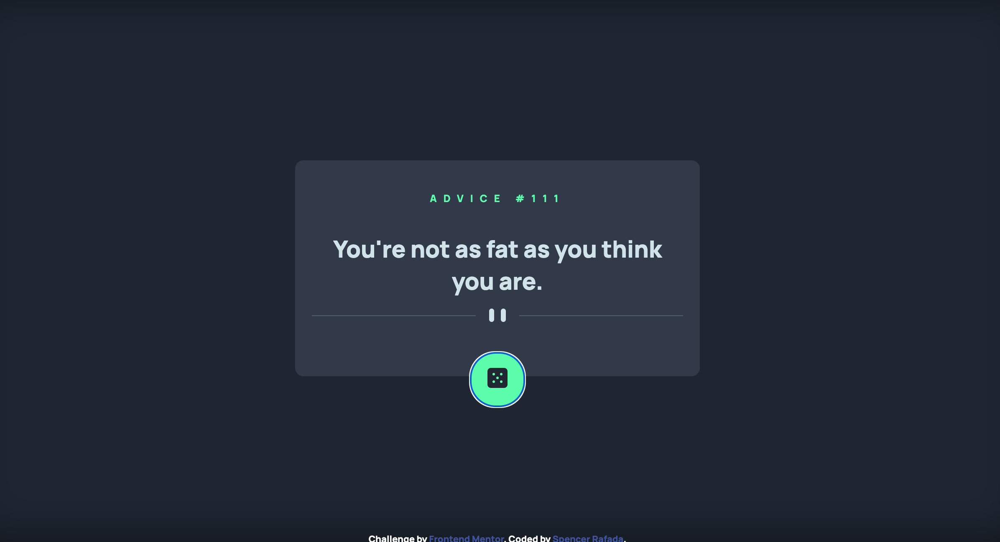
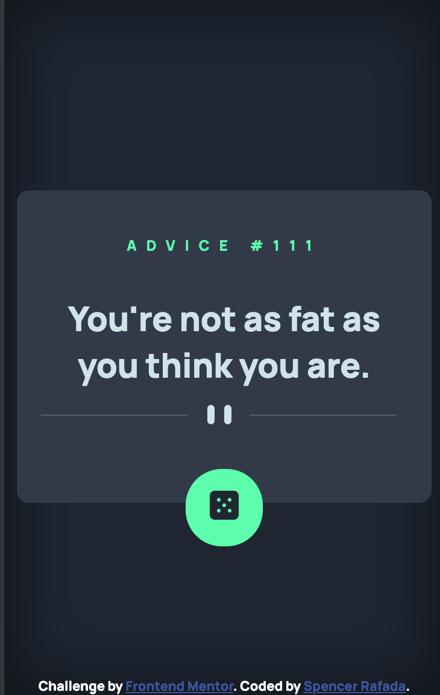

# Frontend Mentor - Advice generator app solution

This is a solution to the [Advice generator app challenge on Frontend Mentor](https://www.frontendmentor.io/challenges/advice-generator-app-QdUG-13db). Frontend Mentor challenges help you improve your coding skills by building realistic projects.

## Table of contents

- [Overview](#overview)
  - [The challenge](#the-challenge)
  - [Screenshot](#screenshot)
  - [Links](#links)
- [My process](#my-process)
  - [Built with](#built-with)
  - [What I learned](#what-i-learned)
  - [Continued development](#continued-development)
  - [Useful resources](#useful-resources)
- [Author](#author)
- [Acknowledgments](#acknowledgments)

## Overview

### The challenge

Users should be able to:

- View the optimal layout for the app depending on their device's screen size
- See hover states for all interactive elements on the page
- Generate a new piece of advice by clicking the dice icon

### Screenshot

### Links

- Solution URL: [GitHub](https://github.com/spencer-rafada/advice-generator)
- Live Site URL: [GitHub Pages](https://spencer-rafada.github.io/advice-generator/)

## My process

I created the HTML first. I filled everything with placeholder texts. After doing so, I wrote the script to fetch the data from the API and load the data to the HTML. I proceeded to write the CSS with SCSS. I designed the CSS with Mobile-First workflow and move to the desktop view with the use of media queries.

### Built with

- Semantic HTML5 markup
- CSS custom properties
- Flexbox
- CSS Grid
- Mobile-first workflow
- [React](https://reactjs.org/) - JS library
- [Next.js](https://nextjs.org/) - React framework
- [Styled Components](https://styled-components.com/) - For styles

**Note: These are just examples. Delete this note and replace the list above with your own choices**

### What I learned

I learned how to center an image in the border of a div. I also learned how to create inner shadow and glow effect on CSS.

### Continued development

I will use the concepts and skills I learned here in other applications / software projects I planned to do. Specially with the Krio App I am thinking of doing.

### Useful resources

- [Inner Shadows CSS](https://designshack.net/articles/css/inner-shadows-in-css-images-text-and-beyond/)
- [Creating Glow Effect CSS](https://codersblock.com/blog/creating-glow-effects-with-css/)
- [Make a 
 full screen](https://softauthor.com/css-make-a-div-height-full-screen/)
- [Center Image on Border of a 
](https://stackoverflow.com/questions/43761169/center-image-on-border-of-a-div)

**Note: Delete this note and replace the list above with resources that helped you during the challenge. These could come in handy for anyone viewing your solution or for yourself when you look back on this project in the future.**

## Author

- Website - [Spencer Rafada](https://github.com/spencer-rafada)
- Frontend Mentor - [@spencer-rafada](https://www.frontendmentor.io/profile/spencer-rafada)
- LinkedIn - [N. Spencer Rafada](https://www.linkedin.com/in/spencer-rafada/)

## Acknowledgments

One year anniversary with my fiancee. More to come!
